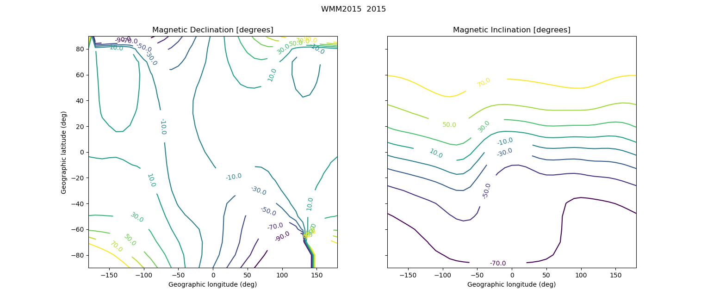

# WMM2015


[](https://lgtm.com/projects/g/space-physics/WMM2015/context:python)
[](https://pypi.python.org/pypi/wmm2015)
[](http://pepy.tech/project/wmm2015)


WMM2015 World Magnetic Model...in simple, object-oriented Python.
[WMM2020](https://github.com/space-physics/wmm2020) is also available.
Tested on Linux, Mac and Windows.
Most C compilers work.
At this time Visual Studio is not supported since MSVC doesn't export function symbols without additional headers,
which is typically done with something like SWIG.



## Install

for the latest release from PyPi:

```sh
python -m pip install wmm2015
```

Optionally, to get the cutting-edge development version:

```sh
git clone https://github.com/space-physics/wmm2015

python -m pip install -e wmm2015
```

This Python wrapper of WMM2015 uses our build-on-run technique.
The first time you use WMM2015, you will see messages from the build system and C compiler.


## Usage

an example script

```sh
python RunWMM2015.py
```

or as a Python module:

```python
import wmm2015

mag = wmm2015.wmm(glat, glon, alt_km, yeardec)
```

## Reference

* WMM2015 [inclination map](https://www.ngdc.noaa.gov/geomag/WMM/data/WMM2015/WMM2015_I_MERC.pdf)
* WMM2015 [declination map](https://www.ngdc.noaa.gov/geomag/WMM/data/WMM2015/WMM2015_D_MERC.pdf)
